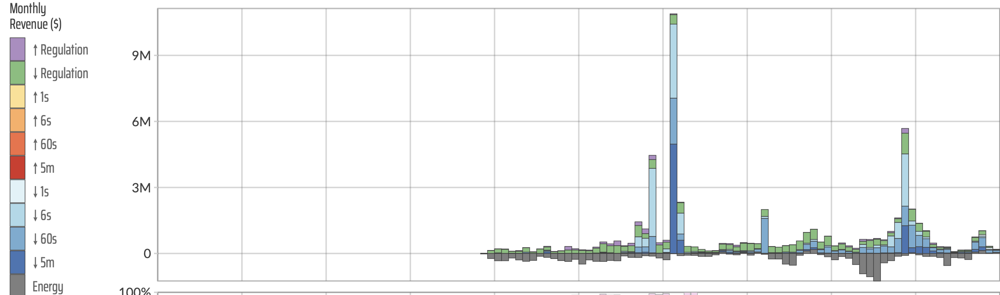
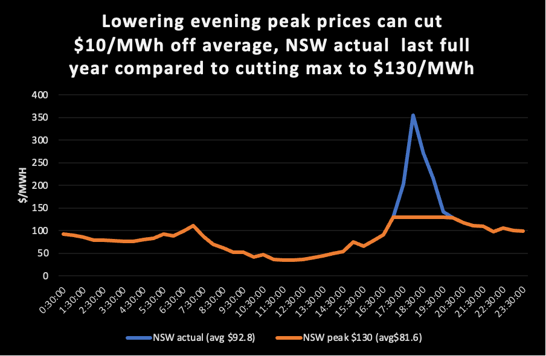

# A definitive reference

Global-Roam and Greenview Strategic Consulting have released the 2023
edition of the Generator Statistical Digest. Each year the digest grows
running close to 1200 pages for the 2023 edition and undoubtedly the
premier reference in the industry

In this analyst's opinion the GSD is worthy of a website in itself,
notwithstanding that the vast quantity of data that has been summarized,
analysed and coherently presented is by nature static and wont change
until the next edition.

Each edition produces new sections and this edition provides more
organization and emphasis on FCAS. Nevertheless there is performance
data on every AEMO DUID.

As an analyst my own focus generally is on having reliable data that can
be massaged, even tortured, into the form required to provide insight
into some analytical question. The skill, if there is any, lies partly
in knowing what questions need to be asked always bearing in mind the
epigram adorning the front page of Copeland and Weston's "Corporate
Finance" namely that the questions remain the same but the answers
change.

Its no secret that the NEM is changing rapidly, and many questions are
asked about that change. Looking at the GSD its already very obvious
that the number of DUIDs are expanding very rapidly. At a guess there
are about 427 DUIDs covered in the GSD. In my own estimation in about
another 5-6 years there will be little focus on the remaining coal
generators and much more about the performance of the more diversified
generator set that is being built to replace the coal generation.

As I mentioned last year, you cannot hope to understand the NEM in all
its beauty without a good appreciation of behind the meter solar and
increasingly behind the meter storage. Behind the meter is the classic
case of the power of numbers and is of course, considered as a whole,
likely by far the most predictable and reliable source of generation in
the NEM. How much more comforting it is to know that we depend on
millions of small units rather than a few large units. If only solar ran
for more than say 8 hours a day.

Equally although its important to understand FCAS revenue, its just as
important or more so in the next few years to understand LRET revenue as
this can be an important driver of generator behaviour.

# Batteries are becoming significant.

Over the past couple of years one technology, initially the butt of
jokes, has come to be taken very seriously and captured a big share of
the incremental investment dollars. And that's batteries, or for
engineers, never satisfied unless there is an acronym, its BESS. Its
become clear that the role of batteries, evident to me for close on a
decade, is moving from the fringes to the mainstream. In the case of the
NEM we can think of the fringe as FCAS or ancillary services, to firming
wind and solar, \[VRE\]. Even on the fringes its now I think, accepted
by the industry that batteries are the ideal technology for frequency
control, capable of virtual inertia as well as very fast frequency
control. Cost reductions driven by learning rates seen the use of
batteries in EVs are now seeing developers start to choose batteries
over pumped hydro projects even in the 8-10 hour duration task.
Development times are so much faster, environmental and more broadly
social license issues are so much easier even if the useful life is much
shorter.

# Battery revenue by source

The GSD is indexed by alphabetic DUID. Unfotunately there is no "fuel
type" index. I was interested to find out where batteries get their
revenue from and how this is changing. The GSD does a great job of
presenting this information. For instance if I look up the battery that
got the ball rolling in Australia, that is the Hornsdale Power Reserve
\[HPR\] (page 684) in the digest can see the following figure.

{width="6.268055555555556in"
height="1.851388888888889in"}
{width="6.268055555555556in"
height="0.14583333333333334in"}

Figure 1 Hornsdale Power Reserve, monthly revenue by segment. Source:
GSD

From this I can see that HPR's revenue is lumpy and that much of its
revenue is derived from lowering frequency. In general its eaerned
negative revenue from selling, and buying energy. Using the excellent
Global-Roam NEM Review product which does allow selection by fuel I was
able to identify the 16 utilty batteries that were in operation at one
time or another in the NEM in the past year. I used these with the GSD
to produce an analysis of batteries by revenue source for all of 2023.

{width="6.268055555555556in"
height="4.090972222222222in"}

/Figure 2 NEM batteries revenue 2023. Source: GSD

Readers should note that battery analysts are really interested in the
"spread" revenue rather than just "sales" as the battery energy has to
be bought as well as sold. Still based solely on the chart it seems that
the sale of "energy" is a big share of category revenue.

Looking at only the FCAS revenue its interesting to see that although
"raise contingency" is the main sector driver a couple of batteries had
lower contingency as the main source.

{width="6.268055555555556in"
height="4.090972222222222in"}

/Figure 3 NEM battery FCAS revenue 2023. Source: GSD

In terms of forecasts I expect both energy and FCAS revenues to grow
over time. As the coal generators close batteries will provide all the
frequency control in an inverter based grid. To the best of my knowledge
based on discussions with the technical people this is not something to
be feared but rather embraced. Batteries can be widely distributed in
the grid providing resilience at many points to frequency shocks.

# Coal units dominate the top revenue DUIDs

{width="6.268055555555556in"
height="4.0875in"}

Figure 4 Top revenue earning units in the NEM 2023. Source: GSD

# Demand response achieves highest volume weighted price but...

Demand Response volumes are tiny as yet and I don't focus on them. For
both producers and consumers what really matters is average day peak
prices. For instance the following figure shows the average time of day
price over the past year for selected States.

{width="6.268055555555556in"
height="3.598611111111111in"}

Figure 5 Major state average time of day prices, last 12 months. Source:
NEM Review

Its clear that that the average time weighted priced is impacted by peak
prices. For instance for NSW last year keeping the average maximum
halfhourly price to \$130/MWh (above the fuel cost of gas) drops NSW
prices by over \$10/MWh.

{width="6.268055555555556in"
height="4.090972222222222in"}

Figure 6 NSW actual prices and impact of lowering only evening peak
prices. Source: NEM Review, ITK

Batteries are already choosing to price above gas in some instance, but
as more batteries are built there will essentially be more competition
to be dispatched and peak prices will come under pressure. Or at least
that is my expectation.

{width="6.268055555555556in"
height="4.090972222222222in"}

Figure 7 Highest average price earners in NEM. Source: GSD

Finally at this glance through the GSD what about the lowest price
receivers?

Certainly there were, as you would expect, some solar farms near the
bottom of the list. Kiama Solar Farm 1 average price was \$12/MWh,
GLENSF1 (Glen Rowan) did worse averaging -9.71/MWh. Essentially it was
generating to earn RECs, not really a happy place should its PPA expire
and conditions not have changed.

However it was interesting to see, given that AGL received just \$22/MWh
for Macarthur wind farm, one of the largest in the NEM.
