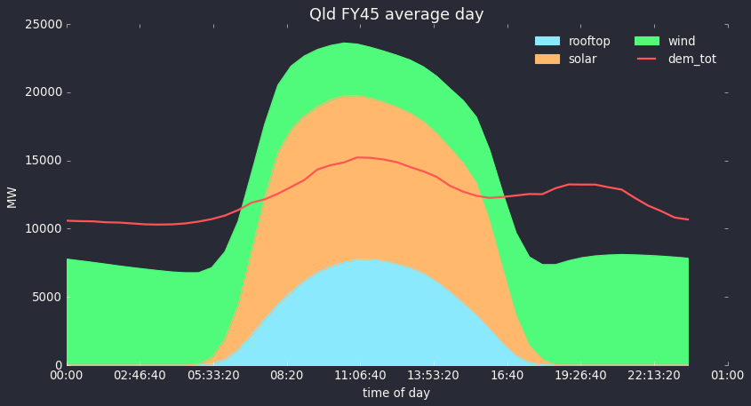
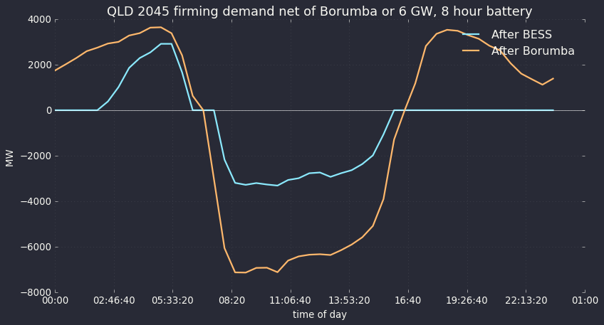
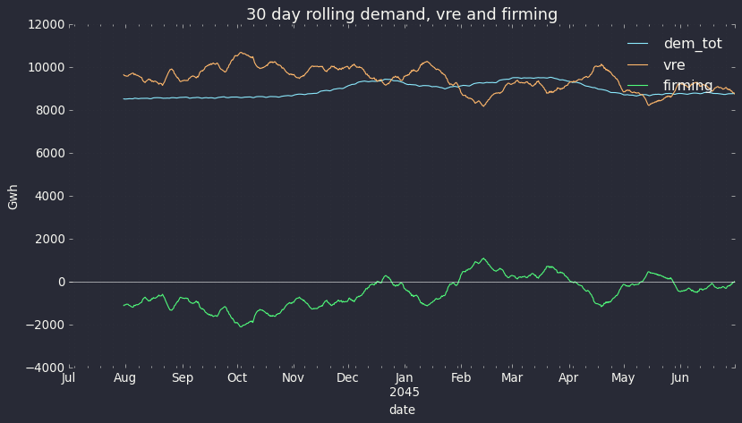
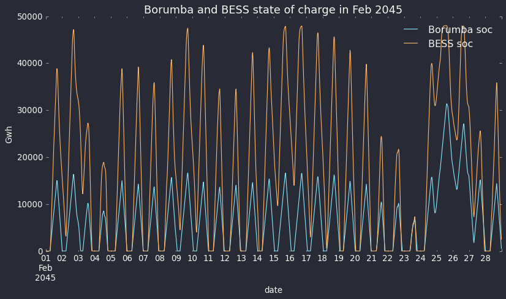

In this note I purport to show that a 6 GW/8 hour battery is a superior
choice to a 2 GW/24 hour pumped hydro station albeit its life is shorter
and its cost is a bit higher. The BESS can provide much more firming
than the pumped hydro system, can provide all the system services QLD
will need and can likely support the transmission network rather than
requiring \$ bns of additional transmission. Of course the transmission
may be needed anyway.

# 6 GW dominates 2 GW 

The recently released information that QLD's Borumba pumped hydro
station will cost \$14 bn for 2 GW of 24 hour storage = 48 GWh is in my
opinion a good reason for the QLD Govt to re examine its options.

Batteries have a higher capital cost than pumped hydro although the
difference based on Borumba is so much less than we are used to
thinking. (see table at end of document)

Also Pumped Hydro once built could be expected to last for 50 years or
more. A battery or as its called a BESS \[Battery energy storage
system\] typically has a life of 20 years based on a rated number of
cycles per year.

That's the end of the advantages of pumped hydro. The disadvantages
include massive social license issues, long build times, a very low
learning rate, cost blow out exposure, limited ability (compared to
BESS) to provide system services (virtual inertia, black start) and
typically lots of transmission.

However the epiphany I had was that Pumped hydro maximum power and
configuration flexibility is non existent. If you build a 2 GW /24 hour
pumped hydro station at best you can provide 2 GW of power for 24 hours.

By contrast a BESS with the same storage capacity as Borumba can be
configured however you like. Specifically you could configure your 48
GWh as 2 GW by 24 hours , 4 GW of 12 hours, 8 GW of 6 hours and so on.

Lets say your BESS was configured as 6 GW of 8 hour storage. That's the
same energy (48 GWh) as Borumba. You can run that as 6 GW operating as 8
hours or you can run 2 GW for 8 hours then the next 2 GW then the final
2 GW. You get 2 GW /24 hour just the same as the pumped hydro. But now
you can take advantage of all the opportunities when you need more than
2 GW but only for a few hours.

# Confirming the obvious with a model

Due to previous work it was easy enough to setup in my very humble ITK
model (not to be compared with space rockets like PLEXOS) a 2 GW 24 hour
pumped hydro asset and also for comparison a 6 GW 8 hour BESS.

The way these models work is purely mechanical I start the storage asset
at 80% full. For every half hour if demand exceeds VRE then the storage
asset trys to fill the gap subject to its maximum power and also how
much energy it has. If it doesn't have enough energy then it supplys
until it is empty. The reverse is true if VRE supply exceeds demand. In
that case the storage asset trys to store the excess subject to its
power and its state of charge. Any excess supply left over is spilled
and is recorded as a negative net firming demand. Results show that the
assets are regularly either empty or full because the QLD needs more
than 48 GWh of storage and more than 6 GW of firming power once it gets
to 100% VRE supply around 2040 on the ISP view.

In this case both assets were assumed to have 75% round trip efficiency
(even though BESS can achieve 85%)

In this exercise I only compared their peforrmance for the hypothetical
FY 2045 in QLD. But the results could very easily be extended. Frankly I
just got lazy. Note my model uses ISP data, if QLD builds its VRE at the
Energy and Jobs plan forecast pace it will get to 100% VRE around 2035.
So while this note focusses on a notional FY45 it might as well by FY35
on the QLD Govt timetable.

First of all I show the average day in FY45 for QLD. The source data is
basically from that provided by AEMO as part of the ISP 2022
documentation. All calculations and adjustments are of course my own.

{width="5.861111111111111in"
height="3.1666666666666665in"}

Figure 1 QLD FY45 (100% renwable) average day. Source: ITK

As stated in the prior note by 2045 some hydrogen demand is included and
AEMO has carefully estimated electrification and EVs and changed the
demand shape accordingly.

Its important to understand that storage has to cope with wind and solar
droughts as well as copinng with the average day. Nevertheless its
interesting to look at the most common situation.

Basically I compared the performance of Borumba with a 6 GW/8 hour BESS
by **looking at the residual need for firming** after operating
whichever storage asset I am modelling. Neither I nor anyone else is
suggesting that Borumba alone can provide all the firming needed in a
decarbonised QLD electricity supply.

The following chart shows the residual demand for firming for both
systems using median data. Medians don't capture extremes (edge cases)
but they still provide a useful view in my opinion.

{width="5.888888888888889in"
height="3.1666666666666665in"}

Figure 2 Median day FY45 QLD firming net of either Borumba or a 6GW
BESS. Source:ITK

On this measure we can see that the 6 GW BESS comprehensively
outperforms the 2 GW pumped hydro asset. Using medians. 6 GW of 8 hour
storage means that no firming demand is needed in the evenings but using
Borumba would still require another 3 GW of firming power in the
evening.

The BESS doesn't perform quite as well in the morning, probably because
its empty on lots of days but even so because it can recharge at 6GW
instead of 2 GW it still does a better job than Borumba.

Consumers big and small don't care about spilled energy, they only care
about having enough power to run as they want to. So for this next graph
I only show results for when demand exceeded VRE. In this modelled year
(FY45) that happened on 9867/17520 = 56% of half hours. The average
demand over those half hours was 11.6 GW and average VRE production 7.4
GW.

The following chart shows a rolling 30 day sum (in GWh) of positive
firming demand after operating our storage assets. That is we ran the
system with Borumba and then ran the system with the BESS. They assets
operated over all half hours (ie recharged when supply exceeded demand)
but the graph just shows how they performed when demand exceeds VRE
supply.

Again the result clearly favours the BESS. Typically the system with the
6 GW BESS requires about 0.8 TWh less additional firming per month
relative to the system with the 2 GW Borumba pumped hydro asset. "net"
means the difference between the Borumba and the BES results

{width="5.680555555555555in"
height="3.0555555555555554in"}

Figure 3 QLD FY45 net firming energy rolling 30 days Borumba v BESS.
Source: ITK

# In FY45 in QLD February is the worst month 

All of this analysis considers QLD as an island. That is a bad way to do
things. NSW and QLD have very complementary wind systems and strong
inter connects between the two States will greatly benefit both. In
another note I'll show that result again. Nevertheless considering QLD
as an island the greatest need for firming comes in February.

{width="5.75in"
height="3.2777777777777777in"}

Figure 4 QLD FY45 rolling 30 day Demand, VRE. Source: ITK

So looking at February 2045 half hour by half hour the following figure
shows the state of charge, in MWh, (maximum is 48,000 when the storage
is full for both systems). The chart shows that both systems are
regularly at zero state of charge but that the extra power of the
battery means it can recharge much more easily than the lower power
Borumba asset and this is what enables it to easily outperform Borumba.

{width="5.736111111111111in"
height="3.388888888888889in"}

Figure 5 QLD FY45 SOC Borumba compared to BESS. Source: ITK

And to further illustrate, the following chart shows model output for
Feb 21, 2045.

The day starts with the BESS or Borumba empty due to having been run
flat the evening before. Neither asset was able to do anything until
solar output went up. After that, because there was enough Sun the BESS
was able to achieve a much higher state of charge \[SOC\] and therefore
could contribute more to evening demand. Note that the SOC lines are in
MWh but other lines are MW. (footnote I can't find a way to make the
chart simpler)

{width="5.805555555555555in"
height="3.2777777777777777in"}

Figure 6 Comparing systems on a low VRE day. Source: ITK

Finally I show some of the actual numbers that were used in compiling
Figure 6. Again note that when the storage asset is charging it loses
some of the energy to running the pumps or in the BESS case to other
losses.

# In table form a subset of the numbers shows:

{width="6.263888888888889in"
height="6.863888888888889in"}

Figure 7 half hourly model output 21 Feb 2045 QLD. Source: ITK

# Economics

As discussed the BESS will have a shorter life than pumped hydro and
also likely higher maintenance cost but can be built far more quickly.
The BESS can also provide additional revenues by managing the grid
frequency. The BESS can be located all along the existing grid likely
providing additional grid capacity but specifically it should avoid most
of if not all the transmission that Borumba requires.

In my last note I took a generous view of the \$14 bn announced Borumba
cost and assumed it included the associated transmission. Some more
reading makes me now inclined to believe that Borumba is currently
costed at \$14 bn plus transmission.

If that's the case the BESS gets within striking difference of Borumba

{width="4.5in"
height="1.8055555555555556in"}

Figure 8 2 48 GWh storage system costs. Source: QLD Gov, ITK

When you have chosen Borumba you will need at least another 2000 MW of
firming and probably another 4000 to catch up with what the 6 GW/8 hour
BESS can do. So all of a sudden I'm asking why so keen on Borumba? Its
true my BESS numbers are a bit of a stretch, lots of assumed cost down,
no transmission costs. Yet I still think if it was me, I'd look again.
