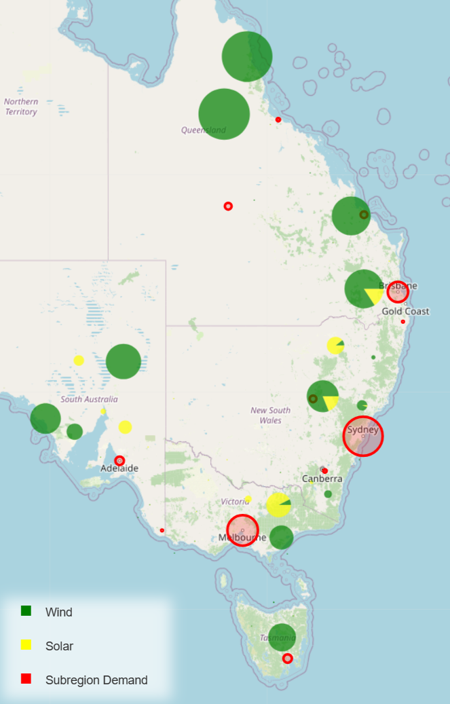
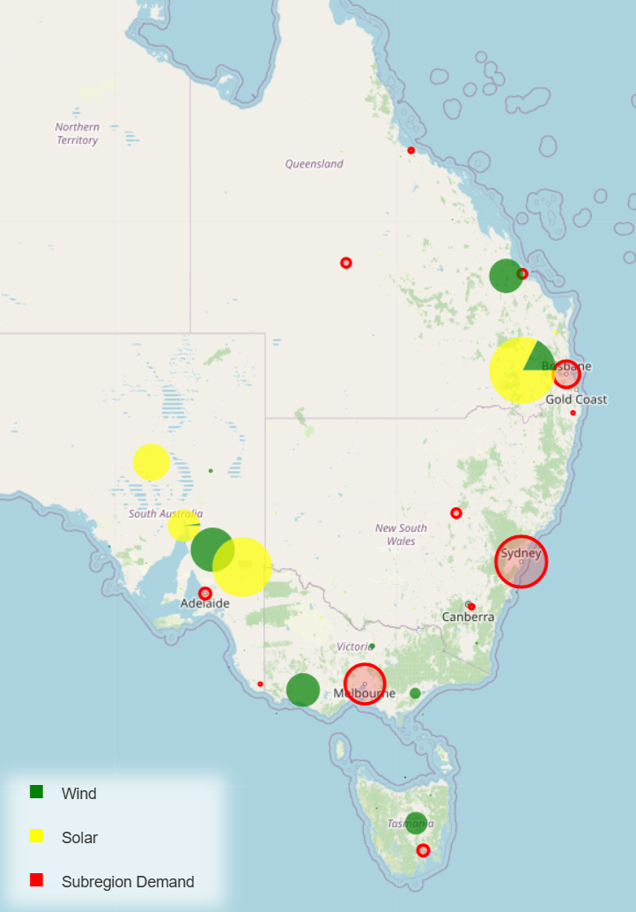
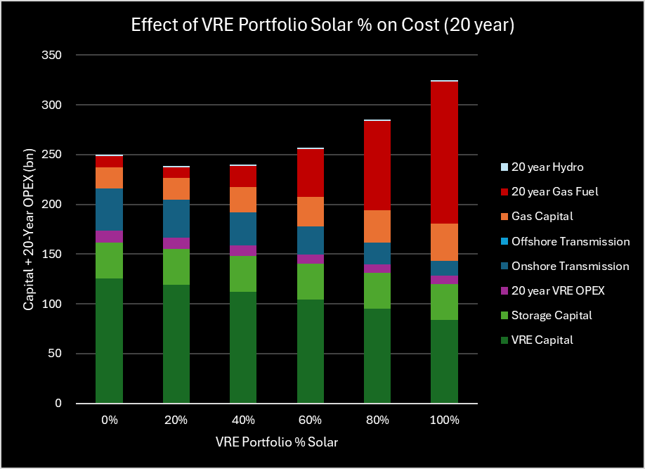

# Renewable NEM from scratch part 2 - includes transmission

As discussed in our Part 1 of our renewable NEM, ITK
built a renewable NEM from scratch, aimed at meeting NEM-wide CY2025
demand. We focussed on generating a VRE portfolio with the highest
Sharpe ratio, that is, the portfolio where average output could not be
increased without also increasing variability. That study took no
account of transmission.

In Part 2 below, we include an estimate of transmission but still
require the portfolio to have VRE meeting a series of targeted "Sharpe"
ratios; the ratio becoming a constraint, while the optimiser minimises
cost. AEMO-modelled demand for CY2025 must be met in every half-hour
period by the modelled VRE portfolio in combination with a fixed
quantity of hydro (equal to historic NEM output), storage (pumped hydro,
or more likely batteries) and variable quantity of gas. As hydro and
storage output were fixed throughout the analysis, the quantity of gas
power and gas generation are outputs of the model. A map of ITK's
preferred VRE portfolio -- with the constraint Sharpe ratio ≥ 4 -- is
shown in Figure 1 below.

{width="3.495833333333333in"
height="5.46875in"}

Figure 1: ITK Preferred VRE Portfolio Map

We use the portfolios generated to estimate the resulting electricity
price that would provide a net present value (NPV) of zero in each case.
Based on our (no doubt optimistic) cost assumptions, these prices turn
out to be in the \$60-\$70 / MWh range, similar to that of consultants
who looked at the NSW, Queensland and Victorian grid decarbonisation
plans. If nothing else, this demonstrates that spending \$200bn doesn't
result in a dramatic increase in electricity prices, quite the reverse.
Eliminating most fuel and other variable costs leads to a stable and
predictable price that is globally competitive. Our cost estimate does
not include rooftop solar; it is taken as a "free good". The authors
learned a lot from this exercise, and we are grateful to AEMO for the
data that makes such studies possible.

## Key Findings

Based on the results from these desktop studies and subject to the
numerous limitations discussed herein:

**Targeting improved system reliability and reduced emissions drives**
**the model towards greater reliance on wind, particularly situated at the**
**fringes of the grid. This approach necessitates a more interconnected**
**NEM and therefore increased initial investment in transmission networks**
**but reduced firming costs in the long run.**

The lowest cost solutions feature greater solar capacity, located
closer to demand centres but extra firming gas to deal with resulting
volatility. Figure 2 and Table 1 illustrate the two extremes, namely
minimum cost over a short amortisation period and maximum system
stability.

{width="3.6347222222222224in"
height="5.205555555555556in"}
{width="3.55in"
height="5.209722222222222in"}

{width="6.268055555555556in"
height="1.8in"}

Amortising the system's capital costs over longer periods yields
similar results to increasing system reliability and reducing emissions.
Namely, the compounding cost of fuel to supply firming gas plants over a
longer period acts to disincentivise solar, driving greater reliance on
wind energy especially at the fringes of the grid and, again, a more
interconnected NEM. Figure 3 shows the Capital + 25-Year OPEX costs of
systems modelled to minimize cost over 10-, 15-, 20-, and 25-year
periods respectively.

![25-Year Cost Breakdown for Portfolio Optimized at 10-, 15-,
20- & 25-Years Amortization[^1]](./media/media/image8.png){width="5.940277777777778in"
height="3.8534722222222224in"}

 

With slightly higher upfront investment -- compared to the lowest cost
solution -- we can significantly reduce carbon emissions and improve VRE
portfolio stability by building a highly-interconnected system more
heavily weighted towards quality wind assets at the fringes of the grid.
To achieve this practically, ITK's preferred VRE portfolio minimizes
total system cost over 25 years subject to exceeding a minimum system
reliability requirement (Sharpe ratio ≥ 4). See Figure 4 which shows
cost breakdown for three key scenarios.

{width="5.573611111111111in"
height="3.7736111111111112in"}

In virtually all simulations and sensitivities, QLD ends up as a
significant supplier of VRE and were it not for the higher costs of
underwater DC transmission, TAS would also be favoured as a large
exporter of wind. More wind in QLD -- particularly in the Northern half
of QLD -- and more QLD/NSW interconnect capacity will be "low regrets"
options in building out the low carbon NEM.

![ ITK Preferred Portfolio Generation and Demand[^2] per State.](./media/media/image10.png){width="5.867361111111111in"
height="4.073611111111111in"}

## Method

Starting with a fresh sheet of paper, we build a wind and solar
portfolio from AEMO's renewable energy zones (REZ's) -- as detailed in
the 2024 Draft Integrated System Plan (ISP) -- add in existing behind
the meter, and firm it with batteries, hydro, and gas to meet NEM-wide
operational demand in every half-hour period for the calendar year 2025.
We build multiple such systems using an optimization algorithm, each
time varying the set of constraints/incentives given to the optimizer.
The system constraints in each scenario are a combination of:

1.  Volatility minimization -- The *Sharpe ratio* of a portfolio is
    inversely proportional to its variability. Practically, we sought to
    maximise the stability of the VRE portfolio by increasing its Sharpe
    ratio.

2.  Cost Minimization -- Costs included:

    a.  VRE Portfolio capital cost and fixed OPEX.

    b.  Transmission Network capital cost.

    c.  Storage capital cost.

    d.  Firming Gas capital cost and running fuel cost.

    e.  Hydro OPEX.

3.  TAS Generation limit -- When stated, we assume that Tasmanian
    generation surplus to state demand must be transmitted to Victoria,
    therefore incurs DC transmission costs.

4.  REZ generation limits -- Capacity of wind and solar for each REZ are
    set to the "Renewable Potential (MW)" values stated in AEMO's 2024
    Draft ISP.

5.  VRE Portfolio generation -- represented as the ratio *VRE Portfolio
    Gen / NEM CY25 Demand*. Sensitivity analysis shows that \~100% -
    110% of NEM CY25 demand is ideal.

6.  Years' OPEX included in total system cost.

Battery power and storage are fixed at ***15 GW*** and ***4 hours***.
Hydro power and capacity are fixed at ***7.5 GW*** and ***14 TWh***.
These values could be optimized in future simulations, as we know that
for any given VRE portfolio, more battery/hydro means less gas and vice
versa.

## Firming

A VRE portfolio with annual output equal to or greater than demand in
the NEM inevitably requires "firming" supplied by some combination of
storage, hydro and gas. In designing such a system there are various
trade-offs between transmission and firming costs. Systems built to
minimize the total firming requirement will end up with more wind, much
of which will be located around the perimeter of the grid, and therefore
result in greater transmission requirements. Once transmission costs are
allowed for, a lower overall cost solution is to have more solar located
closer to demand, and to handle the resulting volatility with extra
firming using gas.

A feature of a high VRE grid is strong seasonality. Output from solar is
lower in winter and wind is also seasonal. When only batteries or pumped
hydro are used to deal with wind and solar supply shortfalls our work
shows that, for any "reasonable" quantity of storage, it is often empty.
This is particularly the case in winter. Our analysis shows that using
gas earlier in the merit order during winter resulted in lower
requirement for storage capacity while retaining "low" gas consumption.
By contrast, using storage early in the supply sequence during spring
and summer -- when VRE output tends to exceed demand -- minimises the
use of gas.

We note that once again QLD output helps with seasonality droughts, as
QLD wind tends to be better in Winter and less in Summer.

## Sharpe Ratio

The Sharpe ratio of a portfolio is inversely proportional to its
variability. Average output of the Sharpe ratio-maximised portfolio
cannot be increased without incurring more volatility. Practically, we
first maximised the stability of the VRE portfolio by increasing its
Sharpe ratio. This showed that the highest Sharpe ratio portfolio was
dominated by Qld and Tasmania onshore wind, but also included about 19%
solar and a small amount of offshore wind. A major limitation of this
analysis being the omission of transmission costs.

Subsequently we estimate the cost[^3] of the system (capital costs,
transmission network costs and OPEX) and generate several cost-minimised
portfolios, gradually introducing minimum Sharpe ratio constraints.
Increasing the minimum Sharpe ratio requirement of the cost-optimizer
incentivises widening the geographical distribution of power generation,
i.e., more generation near the fringes of the grid. This is intuitive:
generally, the greater the distance between two REZ's the less
correlation there is between the weather conditions at the two
locations, particularly for wind. This effect is clearly observed in the
correlation matrices of the wind and solar capacity factors (Figure 6
and Figure 7).

{width="6.177060367454068in"
height="6.0in"}

{width="6.883333333333334in"
height="6.684712379702537in"}

In a Sharpe-optimised system, there is a lot of incentive to allocate
weight to REZ's in Northern Queensland (farthest North), Central South
Australia (farthest West) and Tasmania (farthest South) as this achieves
the widest possible geographic spread of generation. We see this
assertion supported in Figure 2.

Increasing the Sharpe ratio also incentivises wind -- particularly Tas
and Qld wind -- over solar, again intuitively, because:

(a) the power generation of a higher-Sharpe-ratio portfolio would drop
    less drastically overnight.

(b) Solar capacity factors from separate REZ's have a much stronger
    correlation with each other than wind capacity factors. Increasing
    wind in the portfolio therefore has a greater upwards influence on
    Sharpe ratio than solar. See Table 2. The Sharpe ratio of an evenly
    weighted solar-only portfolio is about a third of the Sharpe ratio
    of an evenly weighted wind-only portfolio.

  Table 2: Sharpe Ratio for Solar and Wind Only     
  Portfolios                                        

  **Portfolio                                          Sharpe Ratio**

  Solar Only (Evenly Weighted)                       0.83

  Wind Only (Evenly Weighted)                        2.52

## Impact of constraining Sharpe ratio higher                  

As we increase the minimum acceptable Sharpe ratio (model
constraint) in our cost minimisation model we observe:

1.  More generation at the fringes of the grid, therefore higher onshore
    transmission cost.

2.  VRE portfolio weight more heavily allocated to wind.

3.  Lower firming requirements -- and therefore lower gas capital and
    fuel costs -- as the more stable portfolio with higher wind meets
    NEM demand in a greater portion of half-hour periods. This has an
    exaggerated effect on the system balance through peak demand, and
    overnight, as solar trails off.

Figure 8 illustrates the effect of increasing the Sharpe ratio on the
average day power supply by source (i.e., more VRE, less firming).

{width="7.268055555555556in"
height="4.792361111111111in"}

## VRE portfolio scale impact on cost

As VRE Portfolio capacity relative to NEM demand ("VRE Scale" hereon)
increases, system capital cost increases but firming capacity
requirements decrease. To minimise long term costs, VRE portfolio
generation should be set to 100-110% of CY2025 demand. See Figure 9,
which models the costs of ITK's preferred portfolio at various values of
VRE Scale. The optimal setpoint for this ratio achieves the best
trade-off between VRE capital costs and gas fuel costs. Although
slightly more costly, 110% VRE Scale was preferred, because it had
substantially lower gas requirements than 100%.

{width="6.460416666666666in"
height="5.086805555555555in"}

## Impact of solar as share of VRE

A similar sensitivity analysis was conducted on the Wind / Solar ratio,
by varying the relative amount of each within the portfolio (retaining
REZ ratios within each generation type). The optimum mix sits at around
18.5% Solar (using Draft ISP 2024 data). The greater the solar, the
lower the capital cost, but this comes at the expense of significantly
higher firming requirements, and therefore higher long-term cost.

{width="6.120833333333334in"
height="4.447222222222222in"}

## ITK preferred portfolio

ITK prefers a slightly more expensive system (than the absolute minimum
cost) with greater transmission requirements but significantly lower
reliance on gas. This portfolio minimizes the 25-year total cost of the
system with the following additional requirements:

1.  a Sharpe ratio ≥ 4.0 (set as a constraint in the optimisation model)

2.  VRE scaled to generate 110% of NEM total demand in CY2025, and

3.  Tas generation surplus to state demand must be transmitted to
    Victoria, therefore incurs offshore transmission costs. Given the
    high cost of DC transmission, this constraint renders Tas generation
    surplus to state demand nonviable.

{width="3.8805555555555555in"
height="3.540277777777778in"}

ITK's preferred portfolio consists of:

a.  ***58 GW*** of VRE supplying ***160 TWh*** in CY2025.

b.  ***15 GW*** / ***4h*** of BESS supplying ***3.8 TWh*** in CY2025.

c.  ***13 GW*** of firming gas supplying ***1.5 TWh*** in CY2025.

d.  ***7.5*** ***GW*** / ***14*** ***TWh*** of Hydro supplying ***12
    TWh*** in CY2025.

## Costs

In this note, costs are not intended to be indicative of actual costs
but rather are goals set in the optimisation function. Specifically, the
optimiser takes no account of existing assets other than hydro. No
account is taken of existing gas, existing wind and solar or existing
transmission.

Equally because the VRE and storage are built on an "overnight" basis,
no allowance is made for learning rate impacts which are expected to
drive down the costs of solar and batteries, particularly over the next
decade. ITK's personal expectation is that once we get into the
transmission building phase of the transition that some improvement in
the cost outlook for this component can be achieved.

That said the unit costs and weights of three systems that we built are
shown in Table 3:

1.  **Lowest cost portfolio**, 25-year total cost minimised, Tas
    generation constrained[^4]

2.  **ITK's preferred portfolio**, 25-year total cost minimised, Tas
    generation constrained, VRE portfolio Sharpe Ratio ≥ 4.

3.  **Sharpe-optimised portfolio**. No cost constraint, Sharpe ratio
    maximised.

{width="6in"
height="4.8in"}

Table 4 details our cost input assumptions.

{width="4.791666666666667in"
height="3.388888888888889in"}

To find the price of electricity required to justify the investment, we
ran an NPV analysis and set the price at a level which ensures an
internal rate of return (IRR) equal to the weighted average cost of
capital (WACC). This required all assets, both new and existing, to earn
a return on capital and recover all OPEX.

A shortcut to this process is to take our capital costs per Table 4, add
in a cost of \$3m / MW for 7500 MW of existing hydro, and also allow
\$12 / MWh for wind and \$5 / MWh for solar OPEX, solely for this
specific levelized cost objective. This analysis yielded the following
required electricity prices:

{width="4.875in" height="1.25in"}

From another point of view, one could look at the change in the quantity
of gas generation under each of the scenarios, convert that to gas
consumption and then calculate the marginal cost of CO~2~ abatement as
(change in system costs / change in CO~2~).

## Conclusions

-   More solar means lower stability and more firming requirements but
    is cheaper. A cost minimized system with no other constraints
    favours solar, closer to demand centres. If the amortisation period
    is increased, compounding firming gas fuel costs drive the balance
    towards wind.

-   As we increase Sharpe ratio minimum constraints, we see solar
    gradually dropped for wind, and long-term gas costs traded off for
    upfront transmission costs.

-   A Sharpe-maximized (high stability) system more heavily favours
    wind, particularly at the fringes of the grid, in REZ's with higher
    quality renewable energy leading to lower system volatility and
    firming costs/emissions but higher transmission costs.

-   The high modelled cost of offshore wind means that none of the
    cost-minimised systems allocate weight to offshore wind REZ's.

-   ITK's preference is a highly interconnected, wind-heavy, stable, and
    low carbon NEM. Practically this is achieved by generating a 25-year
    cost-minimized portfolio with a minimum Sharpe ratio requirement.

## Limitations

-   Round trip efficiency losses are ignored.

-   Transmission system modelled is rudimentary. Further work could
    model the transmission network and associated costs more accurately
    and ensure that demand at each of the sub-regional demand centres
    was appropriately met.

-   Firming dispatch order is (essentially) fixed, aside from a simple
    order change in summer/spring vs. winter/autumn. Future work could
    model a dynamic dispatch order.

-   Battery and hydro capacity were fixed. Both the power and hours
    available components of storage and hydro could be optimized in
    further simulations.

-   System costs are rudimentary and do not include rooftop, which is
    taken as a "free good".

[^1]: The optimiser is programmed to generate the lowest cost portfolio over 10, 15, 20 and 25 years respectively. The cost breakdown indicated is the 25-year total system cost for each of these portfolios.
[^2]: Demand values shown below the x-axis (negative)

[^3]: In this note costs are not intended to be indicative of actual costs but rather goals set in the optimisation function
[^4]: Tas generation above state demand incurs offshore transmission costs, as it must be transmitted to Victoria.
