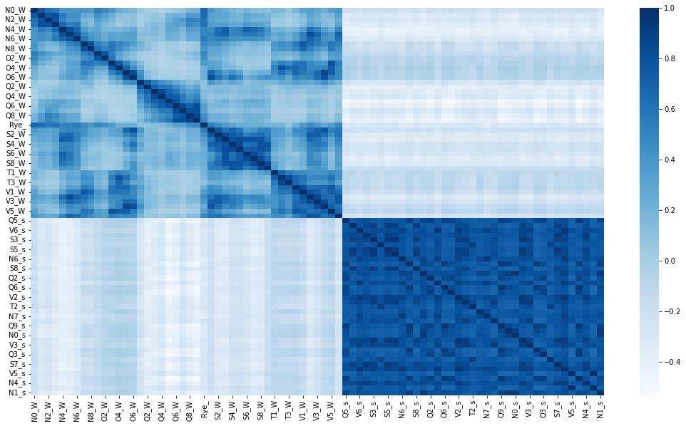

# Conclusions

Despite its pseudo academic nature and many limitations what I
personally take from this analysis is

\(1\) that Queensland should have a huge role to play in the NEM, it
should be getting lots of \$ for transmission both within the State and
for connections South.

\(2\) Equally Marinuslink is likely to be just as useful as building
offshore wind.

\(3\) There is a role for offshore wind, although not as big as the
Victorians want you to believe

\(4\) the existing NEM utility scale renewable portfolio has too much
solar and nowhere near enough wind. The only way that that wouldn't be
true is if storage were far cheaper than it currently appears to be. If
that was true then the lower cost of solar might make it suitable for
charging storage. As it stands though my view is that wind plus
transmission is cheaper than solar plus storage. I am sure others will
have other views.

These conclusions may change as other factors are thrown into the
optimisation algo.

# Summary

This note borrows from the "theory of finance", to build a maximum
Sharpe ratio portfolio of wind and solar farms in the NEM. The average
daily output of the portfolio and its variability can be compared with
the average daily output of utility VRE (that is excluding rooftop) in
the NEM over the past 12 months. I set the "optimised" portfolio to have
the same total output per day as the existing NEM portfolio of wind and
solar farms.

{width="6.263888888888889in"
height="3.2569444444444446in"}

Figure 1 Daily average output optimised portfolio and NEM existing
portfolio.Source: ITK, NEM Review

You can see that the "best" portfolio has a much more constant output
through the day (and is much less seasonal) and for every half hour has
a much lower volatility as compared to the existing, installed wind and
solar farms. Put another way the mean is more stationary with respect to
time of day and season of year and the variance is lower. The Sharpe
ratio (mean/standard deviation) is nearly twice as good as the existing
NEM wide portfolio of wind and solar farms.

I might add that although I have yet to prove it I think it would have a
better capacity factor and likely be lower capital cost. Obviously this
"best" or optimised portfolio would require much less firming.

The optimised portfolio would be heavily concentrated in Queensland (see
fig 3) but the function maximisation algorithm didn't result in much VRE
in Victoria overall by State where O = offshore and numbers are in %

{width="1.0289785651793526in"
height="1.5391437007874016in"}

Figure 2 Optimised portfolio, weighting by State, O = offshore. Source:
ITK

and would have about 77% wind and 23% solar.

I realise the following colour scheme is worse than tasteless but it
shows as a percentage of the total portfolio how much would be allocated
to each zone that the "optimiser" chooses. Most of the results are
generally what I would have expected but I was truly astonished to see
that the algorithm results in a little bit of Tasmanian solar going into
the portfolio. Its interesting that the results have more offshore wind
off the Illawarra than in Gippsland, probably because of the Tasmanian
wind included. These results would likely change quite a bit if
levelized cost of the energy was included, an extension I plan to do for
next time.

{width="6.263888888888889in"
height="3.8027777777777776in"}

Figure 3 Optimised portfolio percentage held by fuel and REZ. Source:
ITK

The portfolio built by the optimisation algorithm only takes account of
the forecast capacity factors for each half hour for each fuel for each
REZ. It doesn't account for cost, correlation with demand, transmission,
social license, rooftop solar. Some of these things (rooftop solar and
capital cost) can easily be accommodated and I may do so in a future
note. Others are more difficult. Also we aren't dealing in the real
world with a fresh sheet of paper.

However what I personally take from this analysis is that Queensland
should have a huge role to play in the NEM, it should be getting lots of
\$ for transmission both within the State and for connections South.
Equally Marinuslink is likely to be just as useful as building offshore
wind.

These conclusions may change as other factors are thrown into the
optimisation algo.

The following map taken from the ISP shows where the REZs are located
with the notation first letter = State and then the number is the zone
within the State.

{width="6.263888888888889in"
height="8.68125in"}

Figure 4 REZ locations, source: AEMO

# Wind and solar farms as a portfolio -- the lessons from finance

I wrote about the idea of seeing wind and solar farms through the lens
of finance theory 's "efficient frontier" last
[June](https://reneweconomy.com.au/how-offshore-wind-could-influence-aemos-20-year-green-energy-blueprint/).
In this note I continue that journey by employing the Sharpe Ratio to
build an "optimal" portfolio of wind and solar in the NEM.

The Sharpe ratio in finance is the ratio of the expected return on a
security divided by its standard deviation. It's a measure of the return
you get relative to the risk of getting that return.

The idea is that by building a portfolio of securities you can improve
your overall Sharpe ratio, that is a portfolio will give you a higher
return for a given level of risk than you can get from owning individual
securities. This happens mainly because the standard deviation of a
portfolio is less than the standard deviation of the individual
securities. They don't all go up the same amount at the same time and
vice versa.

To demonstrate that, you need to calculate the mean expected return of
the portfolio and its standard deviation. I want to avoid the maths as
far as possible, mainly because I'm not very good at it, but its
important to appreciate that the variability of the portfolio return
depends not only on the variability of each stock considered on its own
but also their "covariance" or the extent to which stock returns tend to
move together.

The other important thing that the portfolio return and standard
deviation depend on, is how much you put into each stock. That is the
relative weight of the stock in the portfolio. Its finding those weights
that is the point of this note.

# 40 REZs, two fuels, 40 million data points

Translating these ideas into the world of Australian renewable energy
our portfolio consists of the 40 REZs that AEMO provided data for in the
2022 ISP. In each REZ AEMO provided the expected half hourly output
between July 2022 and June 2052 of a 1 MW wind farm, and a 1 MW solar
farm. In fact for wind they provided a high and low series. So that is
basically 120 series of roughly 0.5 million half hourly forecasts each
or roughly 60 million data points.

For the wind data I took a simple average of the high and low series for
each zone.

In renewable energy we care about (1) the capacity factor = actual
output per year/(24/7 output) (2) the variability of the output or how
likely it is to be running at any given time, like dinner time and (3)
other factors like cost and location.

Solar is more predictable in output than wind but nevertheless has a
higher variability because it doesn't run at night.

The following chart attempsts to illustrate the concept of the Sharpe
ratio. It shows the best 15 **wind** zones sorted in order of Sharpe
ratio best to worst. The chart shows the capacity factors and the
volatility. You can see that Queensland in general and North Queensland
in particular has both a good capacity factor and a relatively low
volatility of output.

{width="5.875in"
height="2.5972222222222223in"}

Figure 5 Best wind farm locations. Source: ITK,AEMO ISP

The offshore wind zones (in blue) have good capacity factors but are,
like the Tasmanian ones typically more volatile than the Queensland
ones. The six best zones as measured by the Sharpe ratio are all in
Queensland and Tasmania. No NSW wind farm makes the "best" Sharpe ratio
list and only one in South Australia. Again this list doesn't pay any
attention to cost, or demand correlation or access to transmission, or
social license.

Repeating the same exercise for solar shows that the capacity factors,
and the not shown here Sharpe ratios are much closer together and that
Queensland, NSW and South Australia are the best regions for solar.

Also if you compare the scales for the wind and solar charts you will
see, as expected, that wind capacity factors are higher than solar and
the standard deviation of wind is lower. The latter result is because
the wind does blow at night.

{width="5.930555555555555in"
height="2.5972222222222223in"}

Figure 6 Best solar farms.Source: ITK, AEMO ISP

For some colour relief and a more pleasing to the eye but generally
abstract figure shows the correlation of each of the 80 wind and solar
zones with each other. Perhaps as someone suggested it would make a good
corporate symbol

{width="6.263888888888889in"
height="3.89375in"}

Figure 7 Renewable energy correlation. Source: ITK , AEMO ISP

# The optimisation process

The problem is to find the weights for each zone in the portfolio of
wind and solar zones that maximises the sharpe ratio of the portfolio.
There are at least two ways of doing this that I know of. The first way
is just to run a loop that throws random weights at the portfolio and
then choose the one with the best Sharpe ratio. There is nothing
inherently wrong with this method. The second way and what I did is to
use some kind of "solver" engine. I used a solver available as part of
the scipi python package . It took 20 minutes and 3000 iterations to
find its "best" set of weights which were constrained to be between 0
and 1 and to sum to 1.

The following figure shows the Sharpe ratio for every REZ wind/solar
combo as well as for the existing utility wind and solar farms and
finally the "Optimised" portfolio. You can see that the Optimised
portfolio performs about twice as well as the exising NEM portfolio and
the existing NEM portfolio beats any existing individual REZ. As it
turns out the yellow bars are the solar farms and the blue bars the wind
farms. Again you can see the uniformity of the solar farms on this
scale.

{width="7.1832020997375325in"
height="3.2873906386701663in"}

Figure 8 Sharpe ratios for REZs and for existing NEM portfolio and
Optimised. Source: ITK, AEMO ISP
