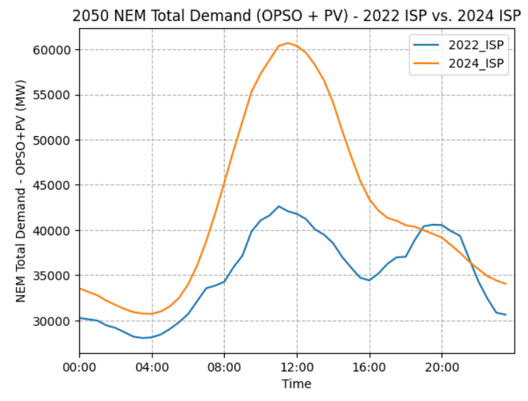
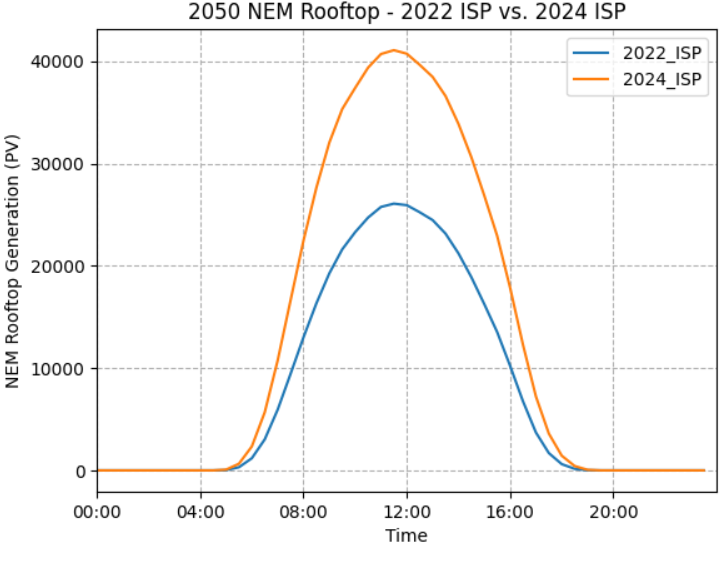

# Introduction

As we were reminded (several times) in AEMO's 2024 Draft Integrated
System Plan (ISP), *"Renewable energy connected by transmission, firmed
with storage and backed up by gas is the lowest cost way to supply
electricity to homes and businesses throughout Australia's transition to
a net zero economy*".

In light of AEMO's assertion, starting with a fresh sheet of paper we
built a maximum Sharpe ratio wind and solar portfolio, added in existing
behind the meter and firmed it with batteries, hydro and gas to meet
NEM-wide operational demand for the calendar year 2025. Professor
William Sharpe won a Nobel prize in 1990 for his contributions to the
Capital Asset Pricing Model (CAPM) in finance and also developed the
so-called Sharpe Ratio. The key insights of Sharpe and his colleagues
was to show that a portfolio of shares would have a lower variability
for a given return than any individual stock. A corollary is that it's
the contribution of the stock to the portfolio that matters rather than
the merits of the stock in isolation. It seemed to us that these
concepts were applicable to wind and solar. A portfolio of wind and
solar farms will have a lower variation for a given capacity factor than
individual projects. The Sharpe ratio for wind and solar projects is
operationalised as the expected capacity factor/divided by standard
deviation.

Using Python and an optimiser and AEMO half hourly REZ traces for wind
and solar we built a 1 MW maximum Sharpe ratio portfolio and then using
AEMO half hourly demand forecasts scaled the portfolio so that total
demand equalled total supply. Then we calculated sequential half hourly
demand and supply balance resulting in either energy available for
storage or firming required. Enough firming was provided so that demand
was met in every half hour for CY 2025. We then applied capital costs,
and in the case of gas fuel costs, to build up the total cost of the
system and then ran sensitivity tests with the objective of minimising
total system cost. Our work remains at an early stage, even though in
Leitch's case he's been developing this concept for more than four
years. A glaring, but soon to be remedied element of this thought
experiment is that transmission costs are not yet included. Once they
are we expect the optimal solution to change. To the extent this work
has any value it's in comparing what a theoretical new system might look
like with the existing system. Above all the exercise shows the benefit
of diversification of renewable resource but, because of transmission,
the cost of achieving it. Another epiphany is that optimisation in the
use of storage assets can greatly reduce the overall cost.

As part of the work, we take advantage of new data provided with the ISP
2024 data set such as sub regional demand and also briefly compared the
2024 ISP demand forecast with that of 2022.

# Key Takeaways

-   Industry lore of 75% wind / 25% solar holds (almost) true in our VRE
    portfolio optimization exercise. We incentivised a model to generate
    a solar/wind portfolio from AEMO's Renewable Energy Zones (REZ's)
    that maximizes its return relative to risk (Sharpe ratio), and no
    constraints were placed on the proportion of wind and solar, nor the
    geographical distribution of the generation. The generated portfolio
    came to 77% wind, 23% solar. Indeed, in subsequent sensitivity
    analyses, varying the wind to solar ratio either side of this
    optimum increased the long-term costs of the system (capital +
    fuel + firming dispatch). Increasing solar % of the portfolio
    decreases the upfront costs, but significantly increases firming
    capacity requirements and expenditure on fuel for firming gas
    generation over time.

-   Generation in this Sharpe-ratio optimized portfolio is very heavily
    weighted to Far North Queensland. This portfolio sees Qld, SA, and
    Tas being net exporters, NSW and Vic net importers of energy. Given
    the location of the demand centres, it is highly likely that an
    optimized system which accounts for transmission costs will shift
    generation further South.

-   The optimized VRE + Firming Capacity system modelled in this
    analysis requires:

    -   ***56 GW*** of *Variable Renewable Energy capacity* supplying
        ***160 TWh*** of energy in 2025,

    -   ***15 GW*** / ***4 hours*** of *storage capacity* supplying ***3
        TWh*** of energy in 2025,

    -   ***7.5 GW*** / ***14TWh*** of (existing) *Hydro*, and

    -   ***8 GW*** of *open cycle gas* supplying ***4 TWh*** of energy
        in 2025.

> The total capital (excluding Hydro) is ***\$169 billion***. The VRE
> cost is ***\$123 billion***, and gas firming capacity cost ***\$46
> billion***.

-   The amount of battery storage required is dependent on the order in
    which firming resources are used. If Batteries are dispatched first
    the seasonal nature of VRE production means that there will be large
    surpluses at times but also very large deficits. If dispatched last
    the batteries spend too much time at full capacity with surplus VRE
    wasted. Realistically there is a large incentive to discharge full
    batteries when sunlight is abundant. By dispatching batteries first
    in Summer but last in winter, an additional ***2.6 TWh*** of
    additional energy can be supplied by batteries instead of gas.
    Refining the dispatch algorithm seems to offer the promise of
    further reducing the overall theoretical cost.

# 2022 ISP vs. 2024 ISP

The 2024 ISP generally forecasts higher rooftop PV compared with the
2022 ISP. This gap starts relatively small (around 2023-2025) and
significantly widens over time. According to the AEMO 2024 Draft ISP
*"Consumer Energy Sources are forecasted to be taken up even faster than
before, with 18GW more rooftop solar by 2050 under Step Change compared
to the 2022 ISP"*. Increased EV uptake also significantly bumps daytime
total demand, as consumers leverage increased rooftop solar to charge
their cars.

{width="7.208333333333333in"
height="2.7909722222222224in"}{width="7.208333333333333in"
height="2.7909722222222224in"}

Figure 1 -- 2024 ISP demand forecast compared to 2022 forecast by time
of day in 2050 (Source: *AEMO 2022 ISP and 2024 Draft ISP)*

# Sharpe-Ratio-Optimized VRE Portfolio

## Sharpe Ratio and Portfolio Diversification

Using 2022 ISP wind and solar half hourly traces from 2023/07/01 --
2052/06/30 (508464 datapoints) we generated a VRE portfolio that
maximizes return (mean REZ capacity factor) relative to risk (standard
deviation of REZ capacity factors). In other words, weights are
distributed across the REZ's in order to maximize the portfolio's Sharpe
ratio. While our optimizer doesn\'t impose geographical distribution
constraints, the Sharpe ratio inherently encourages diversification
across REZ\'s by forcing it to reduce portfolio volatility. For
instance, when wind is subdued in Far North Queensland (Q1), it may be
blowing a gale in Tasmania, but probably not in the North Qld Clean
Energy Hub (Q2). Indeed, a 50% Q1 wind / 50% Q2 wind portfolio has a
lower Sharpe ratio than 50% Q1 wind / 50% T1 wind (0.95 compared to
1.03), to provide a very simple example. For the same reason, the Sharpe
ratio incentivises a mix of solar and wind -- the wind still blows while
the sun doesn't shine -- even though wind on average has a much higher
average capacity factor than solar.

## Result

Figure 2 shows how the Sharpe-ratio optimized portfolio is distributed
across the states and between solar and wind. It is heavily weighted to
Far North Queensland (REZ Q1), with 12.2% of the entire portfolio in Q1
wind and 5.4% in Q1 solar. Figure 7 illustrates how the weights are
distributed across the REZ's. Conceptually, the optimization algorithm
has sought out a high capacity-factor wind REZ and heavily weighted
towards that, while still allocating the rest of its weight *relatively*
evenly across the country. Also note that the Queensland REZ's are
spread over a wider range of latitudes than the REZ's in other states.
The portfolio sees Queensland as by far the biggest generator and has a
wind to solar ratio that is line with industry lore, 77% wind, 23% solar
(lore \~ 75, 25).

It's worth noting that during a quick VRE portfolio cost minimization
exercise -- algorithm was incentivised to minimize total capital cost of
VRE portfolio -- with the constraints (1) NEM OPSO demand is met and (2)
a minimum Sharpe ratio was exceeded: Q1 was weighted even more heavily
(\> 30% of total portfolio). Again, this makes sense conceptually. As we
reduce the incentive of the optimizer to increase the Sharpe ratio, its
incentive to diversify the portfolio diminishes, leading to a greater
emphasis on high-capacity-factor REZ's. In this case, the algorithm
cares more about maximizing capacity factors and minimizing cost / MW of
generation than it does maximizing the stability of the system.

{width="6.8805555555555555in"
height="4.273611111111111in"}

Figure 2 -- Tree map of Sharpe-Ratio Optimized Portfolio Distribution

**[\
]{.underline}**

# State Demand vs. Generation

Queensland, SA, and Tasmania will be net exporters and Victoria and New
South Wales net importers of energy based on our VRE portfolio and 2025
operational demand. The net importers happen to be the states with
densest population, by a significant margin, see Figure 3. Logically,
this net import/export status is *partially* explained by having less
land available for high quality renewable energy generation per
(energy-consuming)-capita in the densely populated states.

{width="5.006944444444445in"
height="3.013888888888889in"}

Figure 3 -- Net Energy Balance and Population Density by State 2025
(Source: *AEMO 2022 ISP*)

{width="4.660416666666666in"
height="3.3805555555555555in"}

Figure 4 -- Demand and Generation by State 2025 (Source: *AEMO 2022
ISP*)

It is also explained by the quality of renewable energy in each of the
states. Vic and NSW's REZ's have the lowest mean capacity factors,
highest CFs are in Tasmania and Queensland. Figure 5.

  -----------------------------------------------------------------------
  **State**                        **Mean Capacity Factor**
  -------------------------------- --------------------------------------
  Tasmania                         0.333

  Queensland                       0.327

  South Australia                  0.313

  New South Wales                  0.304

  Victoria                         0.294
  -----------------------------------------------------------------------

Figure 5 -- State average Renewable Energy Capacity Factors (Source:
*AEMO 2022 ISP*)

# Sub-Regional Demand

Figure 6 shows how heavily NEM demand is weighted towards the NEM's
lower latitudes (Sydney-Newcastle-Wollongong and Victoria subregions
alone make up \> 50% of NEM demand in 2025).

{width="5.027083333333334in"
height="3.3666666666666667in"}

Figure 6 -- 2025 OPSO Demand by NEM Subregion (Source: *AEMO 2024 Draft
ISP*)

To contextualize the distance between our VRE portfolio generation and
demand centres, Figure 7 illustrates demand by sub-region alongside VRE
portfolio generation on an Australian map. The significant distance
between the highest generating REZ\'s and the highest-demand sub-regions
underscores the need to incorporate associated transmission costs in
future iterations of portfolio optimization. Given the considerable
distance of the Far North Queensland REZ from major demand centres,
transmission costs are likely to redirect a lot of this energy
generation further South.

**[\
]{.underline}**

{width="5.416412948381453in" height="8.25in"}

Figure 7 -- Sharpe-Optimized Portfolio Generation (Source: *AEMO 2022
ISP*) and AMEO Sub-Regional Demand (Source: *AEMO 2024 Draft ISP*)

# Method 

A system was then designed to meet the NEM operational (OPSO) demand for
every half-hour period of the 2025 calendar year. ISP 2022 half hourly
demand traces for CY 2025 were used, 17520 datapoints. We have assumed
that energy flows freely from the REZ's through to the demand centres as
required and assumed no transmission losses. A transmission network will
be modelled, and the cost of this transmission incorporated in *future
iterations* of this analysis. We then firm renewable energy generation
with storage capacity, pumped hydro, and open cycle gas, per the
following dispatch order.

-   Solar/wind energy is dispatched first. Where combined solar/wind
    generation exceeds NEM demand, the energy is used to charge up
    storage, or spilt when storage capacity is exceeded. For simplicity,
    we have assumed a round trip efficiency of 100%.

-   For any half-hour period where NEM demand cannot be met by
    solar/wind:

1.  In the months September through February, draw energy from storage
    if state of charge (SOC) greater than 80% capacity. Discharge as
    required until capacity \< 10%. Figure 8 shows the impact of
    dispatching battery first in the summer months.

2.  Dispatch Hydro. We've assumed 7.5 GW and capacity of 14 TWh that can
    be drawn down at a cost of \$5 / MWh.

3.  Dispatch open cycle gas. We increase modelled gas capacity to ensure
    that demand is met in every period.

4.  Dispatch storage, if not already dispatched in step 1, above. March
    through August we save storage until last in the dispatch order to
    firm hydro/gas in the case of renewable energy "droughts". This
    ensures that battery capacity isn't low when the NEM experiences
    long "negative runs" where demand exceeds VRE generation. Storage
    capacity is set to 4 hours at 15.4 GW[^1]. Further optimization of
    storage capacity is planned in future analysis work.

  ------------------------------------------------------------------------
  Battery dispatch position          Last              First in Summer
  ---------------------------------- ----------------- -------------------
  Gas Energy Supplied (TWh)          6.647             4.002

  Storage Energy Supplied (TWh)      0.352             2.997

  Time Storage spends full           86.2%             65.0%

  Gas Fuel Cost (millions p.a.)      \$ 665            \$ 400
  ------------------------------------------------------------------------

Figure 8 -- Effect of Firming Dispatch Order on Storage Supply and Gas
Fuel Costs

# Sensitivity Analysis

After modelling the above system, we conducted a sensitivity analysis to
examine the impact of varying the VRE portfolio capacity and the
percentage of solar in the portfolio on both the capital cost and the
combined (capital + fuel) costs over 5, 10, 15, and 30 years. Note, as
this is a sensitivity analysis rather than a detailed costing exercise,
2025 fuel costs were simply extrapolated out over the specified time
periods rather than adjusting annual fuel costs in line with demand.
Future iterations of this work will model more accurate combined costs.

We assumed the following prices when calculating the capital and
long-term costs of our system.

  -----------------------------------------------------------------------
  Item                               Price                  Unit
  ---------------------------------- ---------------------- -------------
  Gas Capital                        \$ 1,200,000           /MW

  Solar Capital                      \$ 1,200,000           /MW

  Wind Capital                       \$ 2,500,000           /MW

  Storage Capital                    \$ 600,000             /MWh

  Gas                                \$ 100                 /MWh

  Storage Dispatch                   \$ -                   /MWh

  Hydro Dispatch                     \$ 5                   /MWh
  -----------------------------------------------------------------------

Figure 9 -- Assumed Capital and Consumption Costs

# VRE Portfolio Capacity

NEM OPSO demand in the 2025 calendar year was 181 TWh. The VRE portfolio
was scaled such that generation would meet a certain percentage of this
demand (i.e., 100% indicates that the VRE portfolio generates 181 TWh
during the 2025 calendar year). In the case of the Sharpe-ratio
optimized portfolio, VRE capacity of 56 GW was required to generate 181
TWh (20.7 GW average) over the 2025 calendar year. Generally, as the VRE
portfolio capacity increases, less firming capacity is required,
reducing fuel costs but increasing capital costs (1GW of wind farms cost
more than 1GW of gas plants). See Figure 10. However, the ratio appears
optimized when VRE is set to generate around 100% - 110% of NEM OPSO
demand, i.e., at a certain point the additional fuel costs become
negligible compared to the increased capital cost of more VRE. See
Figure 11.

A contributor is hydro capacity. With lower VRE capacity, the hydro
capacity (14TWh) is exhausted at some point during the reference year;
the lower the VRE capacity, the earlier hydro runs out. At 100% VRE :
NEM, hydro runs out on the 5^th^ of December, after we've ridden out the
high-demand/low-solar of winter; gas and storage pick up the slack for
the remainder of December. See Figure 16. At 110% VER : NEM we end the
year with some hydro capacity remaining (3.4TWh). Further increasing the
VRE portfolio beyond the 110% ratio essentially "wastes" the cheap hydro
capacity in the eyes of the model/system.

{width="5.7875in"
height="3.8402777777777777in"}

Figure 10 -- VRE Portfolio Capacity: Sensitivity Analysis

{width="5.006944444444445in"
height="3.013888888888889in"}

Figure 11 -- 5-year Cost of Hydro and Fuel for Gas Gen (Billions)

# Wind to Solar Ratio

The total output of each modelled portfolio was set to NEM OPSO demand +
10% for the wind to solar ratio sensitivity analysis. The system was
modelled with 0%, 23.3%, 50%, 75%, and 100% solar. This was done by
scaling the solar and wind portions of the Sharpe-ratio optimized
portfolio accordingly. Notably, the Sharpe-Optimized portfolio (i.e.,
23.3% solar) exhibited the lowest cost over any period greater than 5
years. The effects of increasing solar were:

1.  Slightly reduced capital. Capital reduction tempered by the fact
    that solar has lower capacity factors, so the required portfolio
    capacity to meet demand increases with increasing solar % of
    portfolio.

2.  Increased reliance on hydro/gas/storage to supply power during
    significant shortfall overnight and decreased daylight hours in
    winter, and therefore:

3.  Significantly higher gas demand and long-term fuel costs.

{width="5.555555555555555in"
height="3.7246248906386703in"}

Figure 12 -- Solar % of VRE Portfolio: Sensitivity Analysis

{width="4.7685192475940505in"
height="2.9246227034120733in"}

Figure 13 -- Open Cycle Gas Capacity Required with Increasing Solar % of
VRE Portfolio

# Optimized System

Based on the sensitivity analysis, a system with VRE portfolio scaled to
meet 100% NEM OPSO demand over the 2025 calendar year was selected for
further analysis. Due to Hydro running out in December in this scenario,
the December dispatch order was varied, leaving storage until last (same
as March-August). This ensured sufficient capacity for handling longer
negative runs in December, minimizing the gas power requirements in
those instances.

Figure 14 summarizes the properties and performance of the optimized
system over the 2025 calendar year. We have a 56 GW capacity VRE
portfolio with a capital cost of \$123 billion. Capital cost of firming
capacity required to support this VRE portfolio is \$46 billion (hydro
excluded). As discussed in the sensitivity analysis, there were systems
available with lower upfront cost, but once fuel costs were incorporated
over 10+ years, this system was the cheapest.

{width="7.268055555555556in"
height="3.7944444444444443in"}

Figure 14 -- Summary of Optimized System (Costs, Capacities, Energy
Supplied)

Figure 15 illustrates the energy supply for a 2025 average day, with
firming capacity generally kicking in for the evening peak demand period
and then (mostly hydro) continuing to supply overnight while solar is at
zero. All pretty stock standard. Figure 16 and Figure 17 illustrate the
supply seasonality. Hydro supply is highest March through August, when
hydro is first (and storage last) in the firming dispatch order. Storage
is highest in the months where it is at the front of the firming
dispatch order.

{width="7.0875in"
height="4.99375in"}

Figure 15 -- \"Optimized\" System, Average Day Supply by Source - 2025

{width="4.675in"
height="4.4720188101487315in"}

Figure 16 -- \"Optimized\" System, Total Monthly Supply by Source - 2025

{width="9.35in"
height="6.672471566054243in"}

Figure 17 -- \"Optimized\" System, Average Day Supply for Calendar Year
2025 by Quarter

# Key Assumptions / Limitations

-   2022 ISP demand, solar, wind trace data is used. Future iterations
    of this work will update all underlying data to reflect changes in
    the 2024 Draft ISP.

-   Transmission costs and losses need to be incorporated in a future
    iteration of this work. We understand that this will prove a pivotal
    piece in portfolio optimization, particularly given the (potentially
    unrealistic) geographical distribution of our hypothetical VRE
    generation network in relation to the demand centres.

-   Recommend further optimization of firming capacity dispatch order,
    which is currently relatively static, aside from moving storage up
    the order during months of increased sunlight. Once a more realistic
    firming capacity dispatch order algorithm is in place, storage
    capacity needs to be further optimized.

-   Storage round trip efficiency needs to be incorporated.

[^1]: 15.4 GW of storage meets 99% of shortfall, post-VRE.
